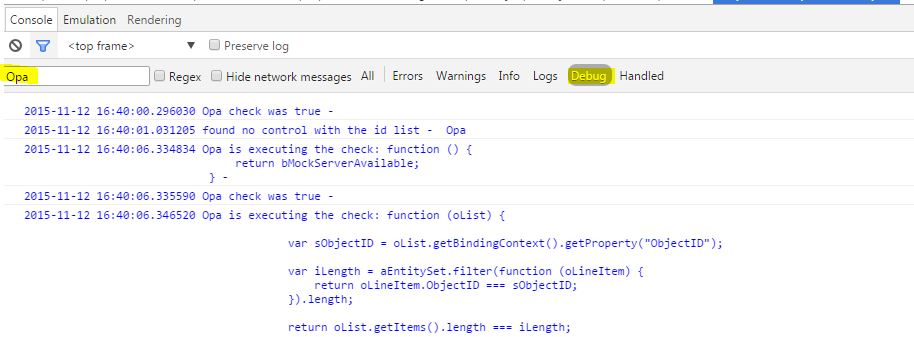

# Pitfalls and Troubleshooting

## Why does OPA not find the control I am looking for?

OPA checks a lot of conditions before it passes a control to your matchers/actions/sucess functions.
If your control does not match these conditions, you will never be able to set a breakpoint.
Therefore OPA logs a lot into the browsers console, if you turn on the debug mode of UI5.
You can either use the sap-ui-debug=true URL parameter or the [UI5 Diagnostics](https://openui5.hana.ondemand.com/#docs/guide/6ec18e80b0ce47f290bc2645b0cc86e6.html).
The Diagnostics may also be helpful to see the state of your UI.

After turning on the debug mode, you can have a look at the log and also filter it by looking for 'opa' or 'matchers'.



Frequent errors are typos in ViewName or control ids. These are easily discovered in the logs.

### A control is not found when running the test on a different machine or in a suite
The size of the iFrame in which the application is loaded is as big as the browser window. It is scaled down to leave space for the QUnit info but the contents are preserved the same as when run in full size. This means that regardless of the small iFrame, you shouldn't see any responsive change in the application's appearance. If the test runs fine locally but a control is not found on another machine, there is a chance that the other machine's screen is too small and triggers the responsive behaviour of some controls. (example: CI executors with screens smaller than the regular big developer screens, or when the test is part of a suite and the iFrame is placed inside a suite wrapper much smaller than the screen). One way is to actually test for the responsive behavior and add conditional `waitFor`-s and test cases. Tests for very different screens (eg. phone and desktop) are better separated in different test files. If you want to workaround the sizing issue and don't want to test responsive behavior, you can set a fixed size for the iFrame. The idea is to write the test for the small size which will most probably result in the central environment. You can use the `width` and `height` parameters of `iStartMyAppInAFrame` or the `opaFrameWidth` and `opaFrameHeight` URL parameters. If either width or height is not defined, the default 100% of the window's body will be set, and later scaled down by 40%.

## My test is sometimes failing - sometimes it's not

### Is it the startup that fails?

Maybe the app is loading too slow for the OPA tests.
When having a local index file that does not contain the library dependencies your application needs,
the UI5 bootstrap is very slow. To fix this add the dependencies you need in your [Application Descriptor's sap.ui.dependencies namespace](https://openui5.hana.ondemand.com/docs/guide/be0cf40f61184b358b5faedaec98b2da.html).
if you do not have a descriptor use the [bootstrap option libs](https://openui5.hana.ondemand.com/docs/guide/91f2d03b6f4d1014b6dd926db0e91070.html)

### It fails in the middle of execution!

If this happens, your test is probably executing actions faster than it should. If you encounter a failure,
look at the current state of the UI - in almost all of the cases an action could not be triggered or a javascript error occurred.
The error should be in the console logs. If an action could not be executed please make sure you use the action parameter of
OPA5's waitFor function. When using the success function for triggering actions OPA5 does not check a lot of things.

Here are examples that occurred in applications:

An application was using the bindingContext of a control in a press handler. OPA5 was way faster than a human user, 
so the HTTP-Request that was sometimes finished by the time OPA5 was executing the check, sometimes it was still pending and there was an exception thrown.
The test failed because OPA was trying to reach a page that could not be shown because of the error.
This had to be fixed in the application coding.

When there was no action parameter available a ListItem got rerendered while a press action was executed on it.
Due to the rerendering the List was not able to perform the click and it was not executed and the test failed.
It only happened sometimes depending on the execution speed of the machine executing the test.
This now is detected automatically when using actions.


## OPA5 is failing on a specific browser what should i do?

### Am i comparing language dependent texts and the browser has a different language?
Check in the logs if your matcher fails because it is checking a text against a different language.
If you want to always execute your tests with the same language use the sap-ui-language=<myLanguage> url or bootstrap parameter.


### It is only the internet explorer
If you are using an IFrame to launch you application, internet explorer is more strict when it comes to objects from removed IFrames.
So if you are using the context of OPA to remember objects, then destroy your frame and then execute a function on the object, you will get a javascript exception.
How do you avoid it? Only remember values like strings or integers when destroying the frame, or use the component startup of OPA5.


## OPA is not even starting and there is no logging

If you require sinon-qunit.js, it overwrites the browser functions setTimeout and setInterval. OPA needs these functions and without them, the tests will not start. You can either set the fakeTimers to false in you test setup, or maybe you do not use sinon together with OPA.

```javascript
module("Opatests", {
    beforeEach : function () {
        sinon.config.useFakeTimers = false;
    },
    afterEach : function () {
        sinon.config.useFakeTimers = true;
    }
});
```

## OPA tests are not stable
For example, this might mean that the tests run fine most of the time, but they fail:
- in automated test runs
- when run with different OPA speeds
- sporadically on various steps

One way to stabilize your tests is to use OPA autoWait and actions.

For more information, see [Cookbook for OPA5](https://github.com/SAP/openui5/blob/master/docs/opa/Subchapters/Cookbook.md)

## Working with controls which set timeouts
Examples of such controls are busy indicators, notification popups and message toasts. These controls generally set a timeout after which the control is supposed to
disappear. In some applications it might be important to ensure that such a control is shown.
Note that if you enable `autoWait` in your tests globally, then you will need to specifically disable `autoWait` in the `waitFor` statements related to these special
controls. For example, if you want to test that a busy indicator is shown during the sending of a request, you don't want to wait for controls to be interactable:

```javascript
oOpa.waitFor({
	autoWait: false,
	id: "myBusyList", // a control that is expected be covered by a busy indicator
	matchers: new PropertyStrictEquals({
		name: "busy",
		value: true
	}),
	success: function (oList) {
		Opa5.assert.ok(true, "My list is busy");
	}
});
```

For more information, see [Cookbook for OPA5](https://github.com/SAP/openui5/blob/master/docs/opa/Subchapters/Cookbook.md)
